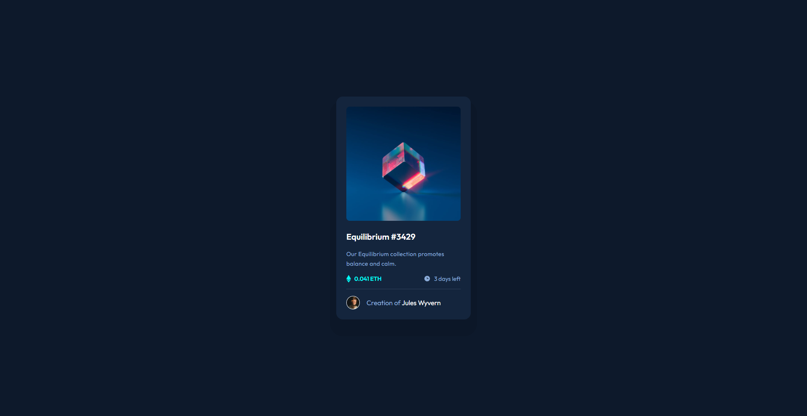

# Frontend Mentor - NFT preview card component solution

This is a solution to the [NFT preview card component challenge on Frontend Mentor](https://www.frontendmentor.io/challenges/nft-preview-card-component-SbdUL_w0U).

## Table of contents

- [Overview](#overview)
  - [The challenge](#the-challenge)
  - [Screenshot](#screenshot)
  - [Links](#links)
- [My process](#my-process)
  - [Built with](#built-with)
  - [What I learned](#what-i-learned)
  - [Continued development](#continued-development)
  - [Useful resources](#useful-resources)
- [Author](#author)
- [Acknowledgments](#acknowledgments)

**Note: Delete this note and update the table of contents based on what sections you keep.**

## Overview

### The challenge

Users should be able to:

- View the optimal layout depending on their device's screen size
- See hover states for interactive elements

### Screenshot

### Links

- Solution URL: [Add solution URL here](https://your-solution-url.com)
- Live Site URL: [Add live site URL here](https://your-live-site-url.com)

## My process

### Built with

- HTML5
- [Tailwind CSS](https://tailwindcss.com/) - CSS Framework


### What I learned

I learn about some **tricky** styling using Tailwind CSS. For example, styling `<hr />` is a bit challenging since you couldn't just write:

```html
<hr class="bg-white">
```

and hoping it works. No no no, that's not gonna happen. Instead, you should use **border** and **then** color it. Like this:

```html
<hr class="border-2 border-white">
```

or if you want a *thin* line, then do this:

```html
<hr class="border-white">
```

Sometimes Tailwind CSS had a problem like this, you should hit google and look for the solution yourself. Since Tailwind CSS is a popular framework, there will be other people who had the same problem like you.

### Continued development

I *still* have a problem with semantic HTML. When you look at the code, it doesn't look very nice. You'll find a bunch of div's that makes it harder to read. It'd be a great help if you could give me a tips about Semantic HTML.

### Useful resources

- [How to Style the HR Element with Tailwind CSS](https://www.slingacademy.com/article/how-to-style-the-hr-element-with-tailwind-css/) - This is how you style `<hr/>` element in Tailwind CSS.